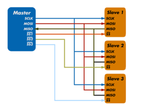
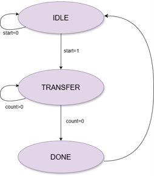
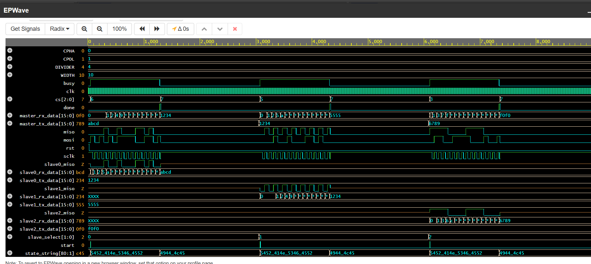

# SPI Protocol Using Verilog

## Overview

This project presents the design and verification of the **Serial Peripheral Interface (SPI) Protocol** using **Verilog HDL**. The design implements a configurable SPI Master-Slave communication system supporting multiple SPI modes, full-duplex data transfer, and multi-slave communication.

The project demonstrates key digital design concepts including Finite State Machine (FSM) implementation, shift-register based serial communication, clock generation, and protocol verification through simulation.

---

## Features

* Supports all SPI Modes (Mode 0, Mode 1, Mode 2, and Mode 3)
* Full-Duplex Communication
* Multi-Slave Architecture
* Programmable Clock Divider
* Parameterized Data Width
* FSM-Based Control Logic
* Shift Register Based Data Transfer
* Tri-State MISO Support
* Comprehensive Testbench Verification

---

## SPI Communication Signals

| Signal | Description                      |
| ------ | -------------------------------- |
| SCLK   | Serial Clock generated by Master |
| MOSI   | Master Out Slave In              |
| MISO   | Master In Slave Out              |
| SS/CS  | Slave Select (Active Low)        |

---

## Supported SPI Modes

| SPI Mode | CPOL | CPHA | Description            |
| -------- | ---- | ---- | ---------------------- |
| Mode 0   | 0    | 0    | Sample on Rising Edge  |
| Mode 1   | 0    | 1    | Sample on Falling Edge |
| Mode 2   | 1    | 0    | Sample on Falling Edge |
| Mode 3   | 1    | 1    | Sample on Rising Edge  |

---

## System Architecture

The SPI system consists of:

* 1 SPI Master
* 3 SPI Slave Devices
* Shared MOSI, MISO and SCLK Lines
* Individual Slave Select Signals

The SPI system consists of one SPI Master and three SPI Slave devices communicating through shared MOSI, MISO, and SCLK lines while individual Slave Select signals are used for slave selection.

---

## Design Modules

### SPI Master

Features:

* Configurable CPOL and CPHA
* Programmable Clock Divider
* Multi-Slave Support
* Full-Duplex Communication
* FSM-Based Controller
* Parameterized Data Width

### SPI Slave

Features:

* Parameterized Data Width
* CPOL and CPHA Compatibility
* Shift Register Based Communication
* Tri-State MISO Output
* Full-Duplex Operation

---

## Finite State Machine (FSM)

The SPI Master is implemented using a three-state FSM.

### IDLE State

* Waits for start signal
* No slave selected
* SPI clock remains in idle state

### TRANSFER State

* Generates SPI clock
* Transmits data through MOSI
* Receives data through MISO
* Performs serial shifting and sampling

### DONE State

* Completes transaction
* Deactivates slave select line
* Returns to IDLE state

### FSM State Diagram

---

## Testbench Verification

The testbench performs:

* Clock Generation
* Reset Verification
* Multiple SPI Transactions
* Multi-Slave Communication Testing
* Signal Monitoring using `$monitor`
* Waveform Dumping using `$dumpvars`

### Test Cases

| Test Case | Master TX | Selected Slave | Expected RX |
| --------- | --------- | -------------- | ----------- |
| TC1       | ABCD      | Slave0         | 1234        |
| TC2       | 1234      | Slave1         | 5555        |
| TC3       | 6789      | Slave2         | F0F0        |

---

## Simulation Results

The design was successfully verified through simulation.

## Simulation Result

---

## Applications

* Flash Memory Communication
* Sensor Interfacing
* ADC/DAC Communication
* Display Modules
* FPGA-Based Systems
* Embedded Systems
* Wireless Communication Modules

---

## Advantages

* High-Speed Communication
* Full-Duplex Data Transfer
* Simple Hardware Implementation
* Faster than I2C Protocol
* Supports Multiple Slave Devices

---

## Limitations

* Requires More Signal Lines
* Separate Chip Select for Each Slave
* No Built-in Error Detection
* Limited for Long-Distance Communication

---

## Author

**Nency Thummar**

Electronics and Communication Engineering

Nirma University

---

## References

1. Texas Instruments – SPI Communication Basics
2. Analog Devices – SPI Protocol Documentation
3. Samir Palnitkar, Verilog HDL: A Guide to Digital Design and Synthesis
4. M. Morris Mano, Digital Design
